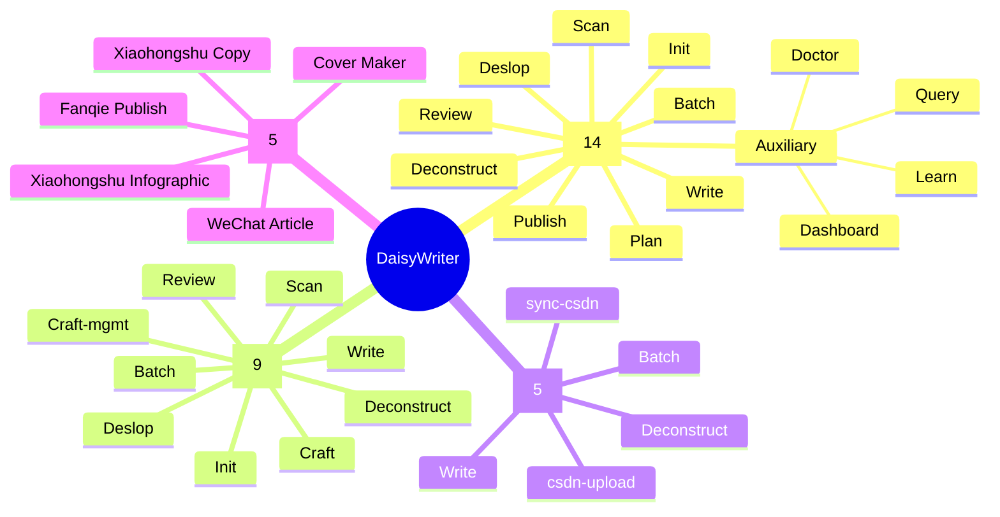
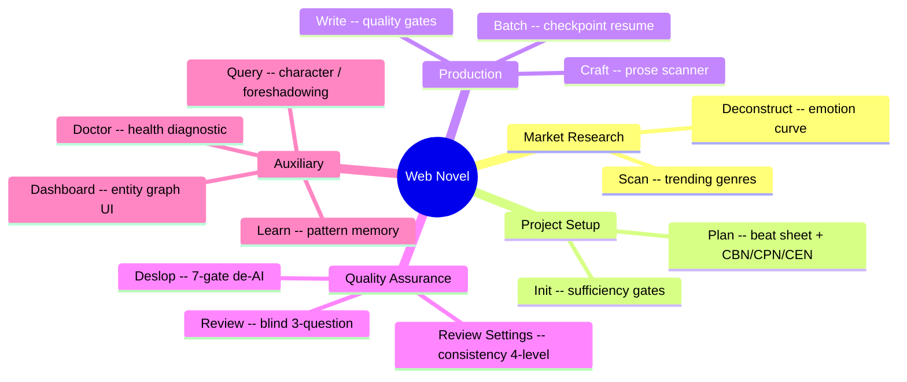
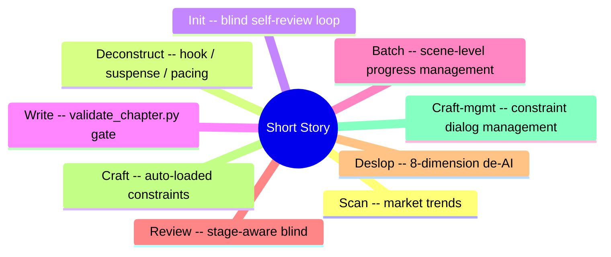
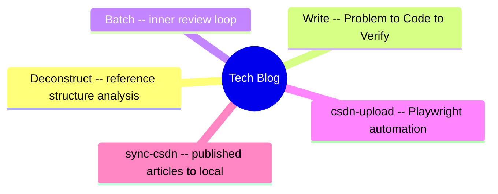
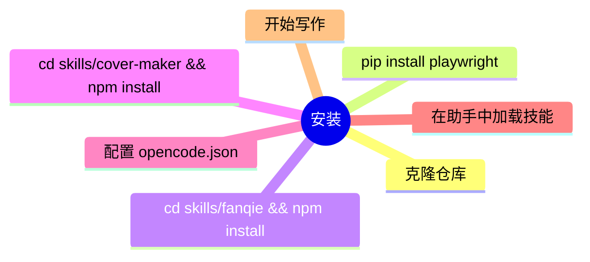

<p align="center">
  <picture>
    <source media="(prefers-color-scheme: dark)" srcset="https://img.shields.io/badge/DaisyWriter-v1.1.0-8B5CF6?style=for-the-badge&logo=openai&logoColor=white">
    
  </picture>
  
</p>

<p align="center">
  <a href="./LICENSE"></a>
  <a href="https://github.com/anomalyco/opencode"></a>
  <a href="https://docs.anthropic.com/en/docs/claude-code"></a>
  <a href="https://github.com/openai/codex"></a>
  <a href="#-快速开始"></a>
  <a href="https://www.python.org/"></a>
  <a href="https://nodejs.org/"></a>
  <br>
  <a href="#-项目概览">中文</a> ·
  <a href="./docs/README.en.md">English</a>
</p>

---

<h1 align="center">✍️ DaisyWriter</h1>

<p align="center">
  <b>把 AI 编程助手变成你的写作工作室。</b><br>
  <i>面向 OpenCode、Claude Code、Codex CLI 的技能集合 —— 覆盖网文、短篇、技术博客、自动化发布。</i>
</p>

---

## 📋 项目概览

DaisyWriter 是一个开源技能集合，能把 AI 编程助手变成专业的写作工具。提供 **33 个可组合的技能**，分为三大写作模块和配套平台工具。

每个模块覆盖完整的内容创作生命周期 —— 从调研规划到草稿、审查、发布。



| Module | Skills | Pipeline |
|--------|:------:|----------|
| 📚 **网文** | 14 | `Scan → Deconstruct → Init → Plan → Write → Review → Deslop → Publish` |
| 📝 **短篇** | 9 | `Scan → Deconstruct → Init → Write → Batch → Review → Deslop → Craft` |
| 💻 **技术博客** | 5 | `Deconstruct → Write → Batch → CSDN Upload` |
| 🔧 **平台工具** | 5 | 封面生成、微信、小红书、番茄发布 |

### 项目结构

```
DaisyWriter/
├── skills/                          # 33 个技能，4 个域 + 工具
│   ├── webnovel/                    #   14 skills
│   │   ├── deconstruct/ init/ plan/ write/ batch/
│   │   ├── craft/ review/ review-settings/
│   │   ├── scan/ deslop/
│   │   └── query/ learn/ doctor/ dashboard/
│   ├── shortstory/                  #    9 skills
│   │   ├── scan/ deconstruct/ init/ write/ batch/
│   │   ├── review/ deslop/ craft/ craft-mgmt/
│   ├── tech/                        #    5 skills
│   ├── fanqie/                      #    1 skill + Node.js/Python scripts
│   ├── cover-maker/                 #    1 skill
│   ├── wechat-article-writer/       #    1 skill
│   └── xiaohongshu-*/               #    2 skills
├── adapters/                        # Platform entry points
│   ├── opencode/                    #   Native SKILL.md
│   ├── claude-code/                 #   CLAUDE.md
│   └── codex/                       #   Setup script
├── docs/                            # Tutorials & references
└── shared/                          # Cross-domain references
```

---

## 🎯 技能分域

### 📚 网文 — 14 个技能

从市场调研到精修章节的完整生命周期，专注长篇小说（起点、番茄、晋江等平台）。



| # | 命令 | 用途 | 核心特性 |
|---|------|------|----------|
| 1 | `/webnovel-scan long\|short` | **扫榜**：多平台畅销榜分析 | 起点、番茄、晋江、七猫等 |
| 2 | `/webnovel-deconstruct <书名>` | 拆解参考作品 | 情绪曲线 + 节奏统计 |
| 3 | `/webnovel-init <书名>` | 交互式项目创建 | 充分性门防止半成品项目 |
| 4 | `/webnovel-plan <卷>` | 卷大纲 + 章节细纲 | 每章 CBN/CPN/CEN |
| 5 | `/webnovel-write <章>` | 单章写作 + 质量门 | 3 模式：default / --fast / --minimal |
| 6 | `/webnovel-batch <起始> <结束>` | 批量写 + 检查点恢复 | 崩溃恢复 |
| 7 | `/webnovel-craft` | 文本质检约束（自动加载） | 量化扫描器 |
| 8 | `/webnovel-review <章>` | 盲审章节 | 3 问门 |
| 9 | `/webnovel-review-settings` | 设定一致性审计 | 4 级严重程度 |
| 10 | `/webnovel-deslop <文件>` | **去除 AI 写作痕迹** | 7 门检测 + 分级去除 |
| 11 | `/webnovel-query <关键词>` | 查询项目状态 | 角色、伏笔、力量体系 |
| 12 | `/webnovel-learn <模式>` | 写作模式存入记忆 | 自动去重 |
| 13 | `/webnovel-doctor` | 健康诊断 | 只读，无副作用 |
| 14 | `/webnovel-dashboard` | 启动 Web UI | 实体图 + 章节阅览器 |

**工作流程：** 从 `/webnovel-scan` 扫榜发现热门类型，`/webnovel-deconstruct` 提取结构模式。`/webnovel-init` 通过充分性门创建项目，`/webnovel-plan` 生成卷大纲。用 `/webnovel-write` 或 `/webnovel-batch` 写章（检查点恢复防崩溃）。质控技能 `/webnovel-craft` 自动运行。盲审 (`/webnovel-review`)、设定独立审查 (`/webnovel-review-settings`)、`/webnovel-deslop` 7 门去 AI 味。

---

### 📝 短篇 — 9 个技能

状态机驱动的创作流程，覆盖知乎盐选、番茄短篇等平台。每个技能都是一个状态门，校验通过才能继续。



| # | 命令 | 用途 | 关卡 |
|---|------|------|------|
| 1 | `/shortstory-scan <平台>` | 扫榜：分析盐选/番茄等平台趋势 | 采集 |
| 2 | `/shortstory-deconstruct <ref>` | 拆解：提取钩子/悬念/节奏模式 | 参考 |
| 3 | `/shortstory-init <数量> <类型>` | 初始化项目 + 盲审循环 | 充分性 |
| 4 | `/shortstory-write <路径>` | 滚动写作 + validate_chapter.py | 字数 |
| 5 | `/shortstory-batch <项目> [起始] [结束]` | 场景级批写 + 进度管理 | 批量 |
| 6 | `/shortstory-review <路径>` | 阶段感知盲审（单篇/全篇） | 盲审 |
| 7 | `/shortstory-deslop <文件>` | 8 维去 AI 味系统 | 去AI |
| 8 | `/shortstory-craft` | 工艺约束（自动加载） | 量化 |
| 9 | `/shortstory-craft-mgmt` | 工艺约束对话式管理 | 配置 |

**工作原理：** 从 `/shortstory-scan` 扫榜发现趋势，`/shortstory-deconstruct` 拆解参考作品。`/shortstory-init` 带盲审循环初始化，`/shortstory-write` 单章滚动写（字数门校验）。`/shortstory-batch` 场景级批量写（写→审严格串行）。`/shortstory-review` 阶段感知盲审，`/shortstory-deslop` 8 维去 AI 味。`/shortstory-craft` 自动加载量化约束，`/shortstory-craft-mgmt` 对话管理工艺规则。

---

### 💻 技术博客 — 5 个技能

结构化技术写作 + CSDN 集成。从拆解参考文章到自动化发布。



| # | 命令 | 用途 |
|---|------|------|
| 1 | `/tech-deconstruct <ref>` | 分析参考文章结构 |
| 2 | `/tech-write <标题>` | 问题 → 方案 → 代码 → 验证 → 总结 |
| 3 | `/tech-batch <目录>` | 批量生产 + 内部审查循环 |
| 4 | `/csdn-upload [--dry-run\|--sync]` | 通过浏览器自动化上传草稿到 CSDN |
| 5 | `/sync-csdn` | 已发布文章同步回本地仓库 |

**工作流程：** 从 `/tech-deconstruct` 分析参考文章结构。`/tech-write` 遵循**问题→方案→代码→验证→总结**结构。`/tech-batch` 批量生产带内部审查循环。`/csdn-upload` 使用 Playwright 浏览器自动化上传草稿到 CSDN（支持 dry-run 和 sync 模式）。`/sync-csdn` 将已发布文章拉回本地仓库。

---

### 🤖 发布 — 番茄小说

浏览器自动化发布章节到番茄小说平台。

| 命令 | 用途 |
|------|------|
| `/fanqie-publish --preview` | 预览解析章节 |
| `/fanqie-publish --login` | 二维码登录 |
| `/fanqie-publish --fill-only` | 保存草稿（安全模式） |
| `/fanqie-publish --confirm-publish` | 立即发布或定时发布 |

### 🔧 平台工具 — 5 个技能

| 技能 | 命令 | 用途 |
|-------|------|------|
| **cover-maker** | `node skills/cover-maker/generate_cover.js <路径>` | AI 为所有候选书名生成 600×800 封面 |
| **wechat-article-writer** | `/wechat-article-writer` | 公众号文章写作 |
| **xiaohongshu-technical-post-copy** | `/xiaohongshu-technical-post-copy` | 小红书技术文案 |
| **xiaohongshu-minimal-technical-infographic** | `/xiaohongshu-minimal-technical-infographic` | 小红书极简技术海报 |

---

## 🚀 快速开始

### 前置要求

- [OpenCode](https://opencode.ai) ≥ 0.6（或 Claude Code / Codex CLI）
- Python ≥ 3.8, Node.js ≥ 18
- Playwright（浏览器自动化，可选）

### 安装

```bash
git clone https://github.com/ricky-theseus/DaisyWriter.git
cd DaisyWriter

# 可选：番茄小说发布
cd skills/fanqie && npm install && npx playwright install chromium && cd ../..

# 可选：封面生成
cd skills/cover-maker && npm install && cd ../..
```

### 使用

添加到 `opencode.json`：
```json
{ "skills": ["path/to/DaisyWriter"] }
```

然后在 AI 助手中：

```python
# 从零开始写网文
skill("skills/webnovel/init")
# 写第一章
skill("skills/webnovel/write")
```



---

## ✨ 设计理念

| 原则 | 说明 |
|------|------|
| **🧠 子 agent 隔离** | 写手和审查者始终是独立的 AI agent，无共享上下文 |
| **🙈 盲审** | 审查者对前一轮零记忆——真正的质量评估 |
| **🚪 多层门** | 充分性 → 工艺（量化）→ 审查（定性）→ 预提交 |
| **📈 仅增量** | 追加从不覆盖。失败只重试失败的步骤 |
| **🧹 干净输出** | 最终文件无版本标记、修订说明或 AI 元数据 |
| **🔬 数据驱动工艺** | 散文扫描器强制量化句长/风格约束 |

---

## 🧩 平台支持

| 平台 | 状态 | 入口 |
|------|------|------|
| [OpenCode](https://opencode.ai) | ✅ Native | [`SKILL.md`](./SKILL.md) |
| [Claude Code](https://docs.anthropic.com/en/docs/claude-code) | ✅ Ready | [`adapters/claude-code/`](./adapters/claude-code/) |
| [Codex CLI](https://github.com/openai/codex) | 🚧 WIP | [`adapters/codex/`](./adapters/codex/) |

---

## 🧭 文档

| 指南 | 中文 | English |
|------|------|---------|
| 快速开始 | [`docs/QUICKSTART.md`](./docs/QUICKSTART.md) | [`docs/QUICKSTART.en.md`](./docs/QUICKSTART.en.md) |
| 网文教程 | [`docs/guide-webnovel.md`](./docs/guide-webnovel.md) | [`docs/guide-webnovel.en.md`](./docs/guide-webnovel.en.md) |
| 短篇指南 | [`docs/guide-shortstory.md`](./docs/guide-shortstory.md) | [`docs/guide-shortstory.en.md`](./docs/guide-shortstory.en.md) |
| 技术博客 | [`docs/guide-tech.md`](./docs/guide-tech.md) | [`docs/guide-tech.en.md`](./docs/guide-tech.en.md) |

---

## 🤝 贡献指南

参见 [CONTRIBUTING.md](./CONTRIBUTING.md) 和 [开发工作流](./docs/WORKFLOW.md)。

所有改动走 分支 → PR → CI → 合并 流程。不允许直接推送 master。

---

## 📄 许可证

**GNU General Public License v3.0** — 参见 [LICENSE](./LICENSE)。

| 组件 | 许可证 | 来源 |
|-----------|---------|--------|
| `skills/webnovel/`, `skills/shortstory/`, `skills/tech/` | GPL v3 | 派生自 [@lingfengQAQ/webnovel-writer](https://github.com/lingfengQAQ/webnovel-writer) |
| `skills/fanqie/` | MIT | Fork 自 [@amm10090/fanqie-publisher-skill](https://github.com/amm10090/fanqie-publisher-skill) |
| 其余 | GPL v3 | 原创 |

---

<p align="center">
  <sub>Built by <a href="https://github.com/ricky-theseus">@ricky-theseus</a> · Star on GitHub ⭐</sub>
</p>
