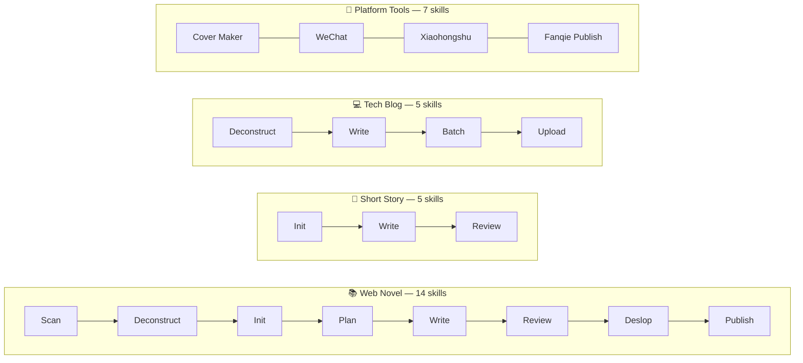
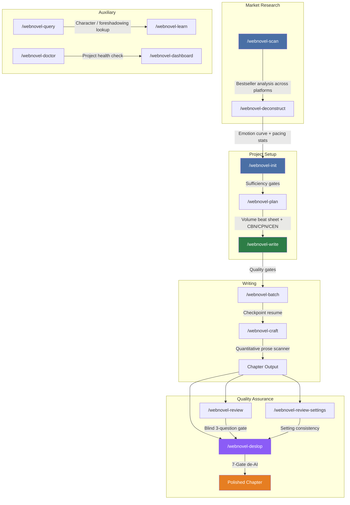
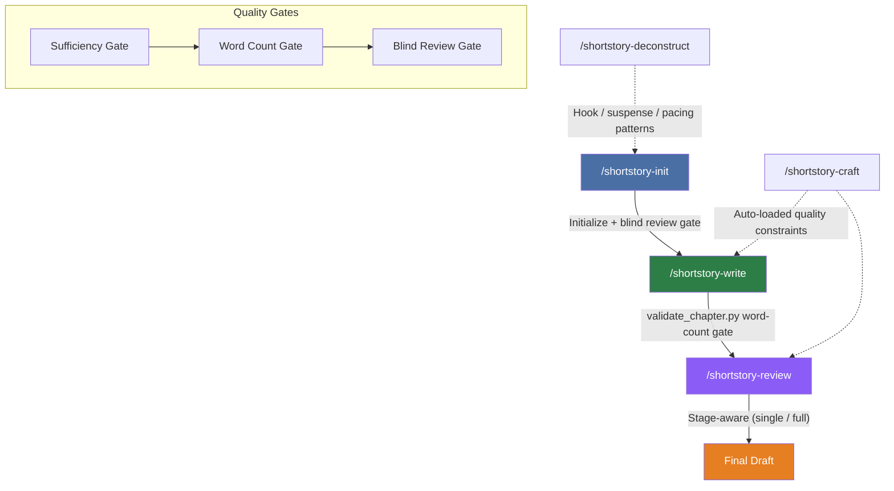
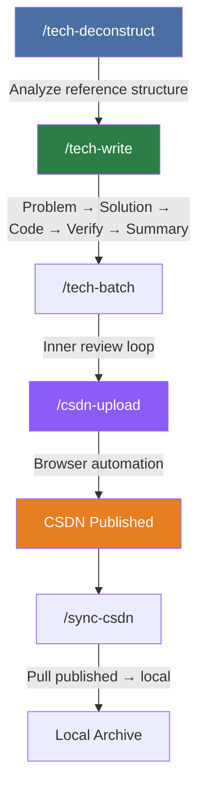
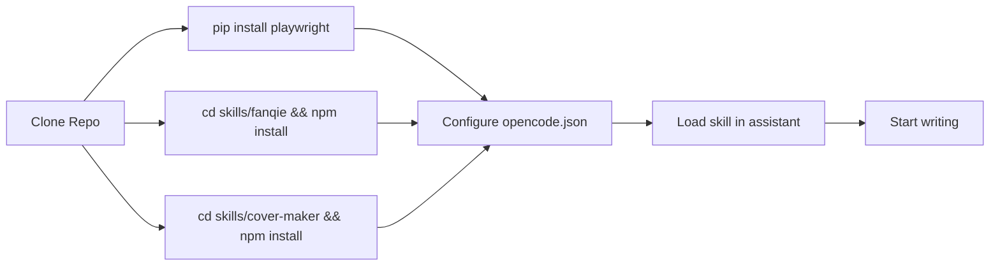

<p align="center">
  <picture>
    <source media="(prefers-color-scheme: dark)" srcset="https://img.shields.io/badge/DaisyWriter-v1.1.0-8B5CF6?style=for-the-badge&logo=openai&logoColor=white">
    
  </picture>
  
</p>

<p align="center">
  <a href="./LICENSE"></a>
  <a href="https://github.com/anomalyco/opencode"></a>
  <a href="https://docs.anthropic.com/en/docs/claude-code"></a>
  <a href="https://github.com/openai/codex"></a>
  <a href="#-quick-start"></a>
  <a href="https://www.python.org/"></a>
  <a href="https://nodejs.org/"></a>
  <br>
  <a href="#-project-overview">English</a> ·
  <a href="./docs/README.md">中文</a>
</p>

---

<h1 align="center">✍️ DaisyWriter</h1>

<p align="center">
  <b>Turn your AI coding assistant into a full writing studio.</b><br>
  <i>A skill collection for OpenCode, Claude Code, and Codex CLI — covering web novels, short stories, tech blogs, and publishing automation.</i>
</p>

---

## 📋 Project Overview

DaisyWriter is an open-source skill collection that transforms AI coding assistants into professional writing tools. It provides **31 composable skills** organized into three core writing modules plus supporting platform tools.

Each module follows a complete content creation lifecycle — from research and planning through drafting, review, and publishing.



| Module | Skills | Pipeline |
|--------|:------:|----------|
| 📚 **Web Novel** | 14 | `Scan → Deconstruct → Init → Plan → Write → Review → Deslop → Publish` |
| 📝 **Short Story** | 5 | `Init → Write → Review → Final` |
| 💻 **Tech Blog** | 5 | `Deconstruct → Write → Batch → CSDN Upload` |
| 🔧 **Platform Tools** | 7 | Cover generator, WeChat, Xiaohongshu, Fanqie publishing |

### Project Structure

```
DaisyWriter/
├── skills/                          # 31 skills across 5 domains
│   ├── webnovel/                    #   14 skills
│   │   ├── deconstruct/ init/ plan/ write/ batch/
│   │   ├── craft/ review/ review-settings/
│   │   ├── scan/ deslop/
│   │   └── query/ learn/ doctor/ dashboard/
│   ├── shortstory/                  #    5 skills
│   ├── tech/                        #    5 skills
│   ├── fanqie/                      #    1 skill + Node.js/Python scripts
│   ├── cover-maker/                 #    1 skill
│   ├── wechat-article-writer/       #    1 skill
│   └── xiaohongshu-*/               #    2 skills
├── adapters/                        # Platform entry points
│   ├── opencode/                    #   Native SKILL.md
│   ├── claude-code/                 #   CLAUDE.md
│   └── codex/                       #   Setup script
├── docs/                            # Tutorials & references
└── shared/                          # Cross-domain references
```

---

## 🎯 Skills by Domain

### 📚 Web Novel — 14 skills

Full lifecycle from market research to polished chapters, designed for long-form fiction (Qidian, Fanqie, Jinjiang, etc.).



| # | Command | Purpose | Key Feature |
|---|---------|---------|-------------|
| 1 | `/webnovel-scan long\|short` | **Scan** bestseller charts across platforms | Qidian, Fanqie, Jinjiang, Qimao, etc. |
| 2 | `/webnovel-deconstruct <title>` | Analyze a reference novel | Emotion curve + pacing stats |
| 3 | `/webnovel-init <title>` | Interactive project creation | Sufficiency gates prevent half-baked projects |
| 4 | `/webnovel-plan <volume>` | Volume beat sheet + chapter outlines | CBN/CPN/CEN per chapter |
| 5 | `/webnovel-write <chapter>` | Single chapter with quality gates | 3 modes: default / --fast / --minimal |
| 6 | `/webnovel-batch <start> <end>` | Batch write with checkpoint resume | Crash recovery |
| 7 | `/webnovel-craft` | Prose quality constraints (loaded automatically) | Quantitative scanner |
| 8 | `/webnovel-review <chapter>` | Blind chapter review | 3-question gate |
| 9 | `/webnovel-review-settings` | Setting consistency audit | 4 severity levels |
| 10 | `/webnovel-deslop <file>` | **Remove AI writing style** | 7-Gate detection + graded removal |
| 11 | `/webnovel-query <keyword>` | Query project state | Character, foreshadowing, power system |
| 12 | `/webnovel-learn <pattern>` | Save writing pattern to memory | Auto-deduplication |
| 13 | `/webnovel-doctor` | Health diagnostic | Read-only, no side effects |
| 14 | `/webnovel-dashboard` | Launch web UI | Entity graph + chapter viewer |

**How it works:** Start with `/webnovel-scan` to discover trending genres, then `/webnovel-deconstruct` to extract structural patterns. `/webnovel-init` creates a project with sufficiency gates, and `/webnovel-plan` produces a full volume beat sheet. Write chapters with `/webnovel-write` or batch-write with `/webnovel-batch` (checkpoint resume protects against crashes). The prose quality enforcer (`/webnovel-craft`) runs automatically. Review is blind (`/webnovel-review`), settings are checked independently (`/webnovel-review-settings`), and `/webnovel-deslop` strips AI writing patterns with a 7-gate detection system.

---

### 📝 Short Story — 5 skills

State-machine-driven writing for Zhihu Yanxuan and medium-length fiction. Each skill is a state gate that validates before proceeding.



| # | Command | Purpose | Gate |
|---|---------|---------|------|
| 1 | `/shortstory-init <count> <genre>` | Initialize projects + blind review loop | Sufficiency |
| 2 | `/shortstory-write <path>` | Rolling write with validate_chapter.py | Word count |
| 3 | `/shortstory-review <path>` | Stage-aware blind review (single / full) | Blind review |
| 4 | `/shortstory-craft` | Quality constraints (loaded automatically) | Quantitative |
| 5 | `/shortstory-deconstruct <ref>` | Extract hook/suspense/pacing patterns | Reference |

**How it works:** The short story module uses a strict state machine. `/shortstory-init` creates a project with a blind self-review loop that forces you to validate the premise before writing. `/shortstory-write` enforces word count gates via `validate_chapter.py`. `/shortstory-review` runs stage-aware blind review (single chapter or full story). `/shortstory-craft` loads automatically for quantitative quality constraints, and `/shortstory-deconstruct` extracts hook/suspense/pacing patterns from reference works.

---

### 💻 Tech Blog — 5 skills

Structured technical writing with CSDN integration. From deconstructing reference articles to automated publishing.



| # | Command | Purpose |
|---|---------|---------|
| 1 | `/tech-deconstruct <ref>` | Analyze reference article structure |
| 2 | `/tech-write <title>` | Problem → Solution → Code → Verify → Summary |
| 3 | `/tech-batch <dir>` | Batch production with inner review loop |
| 4 | `/csdn-upload [--dry-run\|--sync]` | Upload drafts to CSDN via browser automation |
| 5 | `/sync-csdn` | Sync published articles to local repo |

**How it works:** Start with `/tech-deconstruct` to analyze reference articles for structural patterns. `/tech-write` follows a **Problem → Solution → Code → Verify → Summary** structure. `/tech-batch` enables mass production with an inner review loop. `/csdn-upload` uses Playwright browser automation to upload drafts to CSDN (supports dry-run and sync modes). `/sync-csdn` pulls published articles back to the local repository.

---

### 🤖 Publishing — Fanqie Novel

Browser-automated chapter publishing for Fanqie Novel (番茄小说).

| Command | Purpose |
|---------|---------|
| `/fanqie-publish --preview` | Preview parsed chapters |
| `/fanqie-publish --login` | QR code login |
| `/fanqie-publish --fill-only` | Save as draft (safe mode) |
| `/fanqie-publish --confirm-publish` | Publish immediately or schedule |

### 🔧 Platform Tools — 7 skills

| Skill | Command | Purpose |
|-------|---------|---------|
| **cover-maker** | `node skills/cover-maker/generate_cover.js <path>` | AI generates 600×800 book covers for all candidate titles |
| **wechat-article-writer** | `/wechat-article-writer` | Write WeChat official account articles |
| **xiaohongshu-technical-post-copy** | `/xiaohongshu-technical-post-copy` | Xiaohongshu tech copywriting |
| **xiaohongshu-minimal-technical-infographic** | `/xiaohongshu-minimal-technical-infographic` | Minimalist tech infographics for Xiaohongshu |

---

## 🚀 Quick Start

### Prerequisites

- [OpenCode](https://opencode.ai) ≥ 0.6 (or Claude Code / Codex CLI)
- Python ≥ 3.8, Node.js ≥ 18
- Playwright (for browser automation, optional)

### Install

```bash
git clone https://github.com/ricky-theseus/DaisyWriter.git
cd DaisyWriter

# Optional: Fanqie publishing
cd skills/fanqie && npm install && npx playwright install chromium && cd ../..

# Optional: Cover generation
cd skills/cover-maker && npm install && cd ../..
```

### Use

Add to `opencode.json`:
```json
{ "skills": ["path/to/DaisyWriter"] }
```

Then in your AI assistant:

```python
# Start a web novel from scratch
skill("skills/webnovel/init")
# Write chapter 1
skill("skills/webnovel/write")
```



---

## ✨ Design Philosophy

| Principle | Description |
|-----------|-------------|
| **🧠 Sub-agent isolation** | Writer and reviewer are always separate AI agents with no shared context |
| **🙈 Blind review** | Reviewer has zero memory of previous passes — genuine quality assessment |
| **🚪 Multi-layer gates** | Sufficiency → Craft (quantitative) → Review (qualitative) → Pre-commit |
| **📈 Incremental only** | Append never overwrite. Failure retries only the failed step |
| **🧹 Clean output** | No version markers, revision notes, or AI metadata in final files |
| **🔬 Data-driven craft** | Prose scanner enforces quantitative sentence-length/style constraints |

---

## 🧩 Platform Support

| Platform | Status | Entry Point |
|----------|--------|-------------|
| [OpenCode](https://opencode.ai) | ✅ Native | [`SKILL.md`](./SKILL.md) |
| [Claude Code](https://docs.anthropic.com/en/docs/claude-code) | ✅ Ready | [`adapters/claude-code/`](./adapters/claude-code/) |
| [Codex CLI](https://github.com/openai/codex) | 🚧 WIP | [`adapters/codex/`](./adapters/codex/) |

---

## 🧭 Documentation

| Guide | English | 中文 |
|-------|---------|------|
| Quick Start | [`docs/QUICKSTART.en.md`](./docs/QUICKSTART.en.md) | [`docs/QUICKSTART.md`](./docs/QUICKSTART.md) |
| Web Novel Tutorial | [`docs/guide-webnovel.en.md`](./docs/guide-webnovel.en.md) | [`docs/guide-webnovel.md`](./docs/guide-webnovel.md) |
| Short Story Guide | [`docs/guide-shortstory.en.md`](./docs/guide-shortstory.en.md) | [`docs/guide-shortstory.md`](./docs/guide-shortstory.md) |
| Tech Blog Guide | [`docs/guide-tech.en.md`](./docs/guide-tech.en.md) | [`docs/guide-tech.md`](./docs/guide-tech.md) |

---

## 🤝 Contributing

See [CONTRIBUTING.md](./CONTRIBUTING.md) and [Development Workflow](./docs/WORKFLOW.md).

All changes go through branch → PR → CI → merge. No direct pushes to master.

---

## 📄 License

**GNU General Public License v3.0** — see [LICENSE](./LICENSE).

| Component | License | Source |
|-----------|---------|--------|
| `skills/webnovel/`, `skills/shortstory/`, `skills/tech/` | GPL v3 | Derived from [@lingfengQAQ/webnovel-writer](https://github.com/lingfengQAQ/webnovel-writer) |
| `skills/fanqie/` | MIT | Forked from [@amm10090/fanqie-publisher-skill](https://github.com/amm10090/fanqie-publisher-skill) |
| Everything else | GPL v3 | Original work |

---

<p align="center">
  <sub>Built by <a href="https://github.com/ricky-theseus">@ricky-theseus</a> · Star on GitHub ⭐</sub>
</p>
