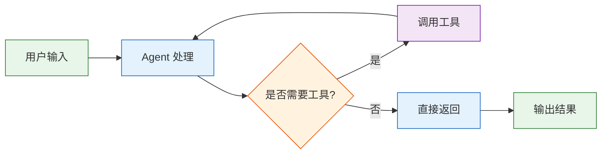

# 撰写技术博文

## 流程

### Step 0：确认选题
- 文章名、目标读者（初级/中级/高级）
- 专题分类（如 `Python\爬虫\Scrapy`，支持 1-3 级）
- 是否已有拆解参考（可指定 `博文/参考文章/` 下的路径）

### Step 1：起草
- 加载参考拆解数据（如有）
- 按标准结构起草：问题→方案→代码→验证→总结
- 代码片段必须可复制即跑
- 草稿输出：`博文/{一级}/{二级}/{三级}/草稿/{文章名}.md`
- 发布后移动至 `博文/{一级}/{二级}/{三级}/已发表/{文章名}.md`

### Step 2：审查
检查清单：
- 代码片段每一段都能复制运行
- 版本号/API 引用明确
- 逻辑链完整，不跳步骤
- 没有空白占位符
- 字数匹配目标读者

### Step 3：定稿
- 去掉文件头部 `[草稿]` 标记
- 更新 `.author/published.json` 记录完成时间

## Mermaid 图规范（全线强制）

所有 Mermaid 框图必须严格执行以下规格，与 AI Agent 系列博文风格一致：

### 图类型
- 流程图：使用 `graph TD`（自上而下）或 `graph LR`（自左向右），**禁止使用 `flowchart`**

### 节点格式
- 所有节点用 `["中文说明"]` 方形节点
- 条件判断用 `{"中文条件"}` 菱形节点
- 文字过长用 `<br/>` 换行

### 禁止规则
- 禁止 `subgraph`
- 禁止纯英文或混合中英节点（除非专业名词如 `push_back`、`unique_ptr`）

### 色彩样式
每张图末尾加 `style` 块定义颜色：
- 开始/结束节点：浅绿色 `fill:#e8f5e9,stroke:#2e7d32`
- 处理/操作节点：浅蓝色 `fill:#e3f2fd,stroke:#1565c0`
- 条件/判断节点：浅橙色 `fill:#fff3e0,stroke:#e65100`
- 数据/输出节点：浅紫色 `fill:#f3e5f5,stroke:#7b1fa2`

### 示例（AI Agent 系列标准图）


### 示例（数据结构类图）


## 模式

## 目录结构

```
博文/
├── 参考文章/{一级}/{二级}/{三级}/{文章}/   ← 拆解参考
└── {一级}/{二级}/{三级}/                     ← 正文（草稿+成品混放）
    └── {文章名}.md
```
